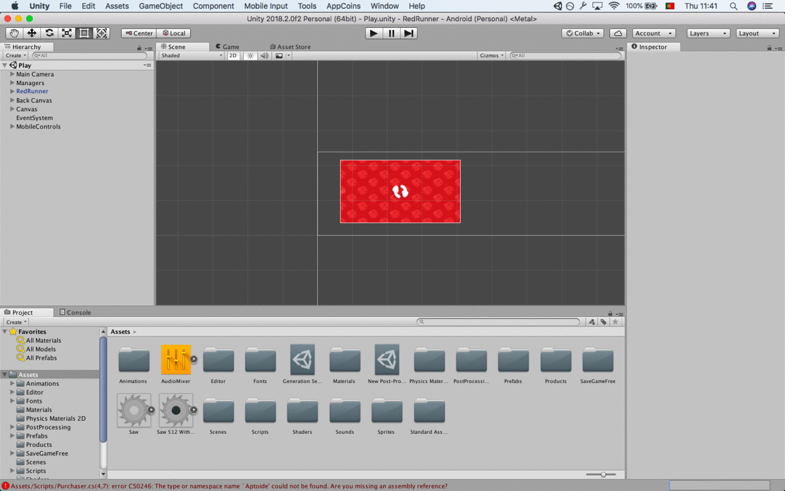
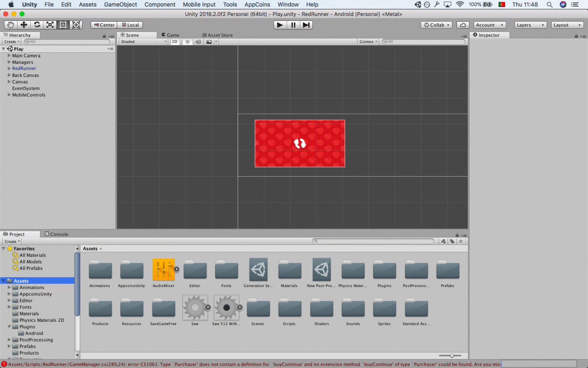

# Red Runner

We created this project to give you another example of how you can integrate the _Appcoins_ plugin to your game. For this example we are using an open source game called __Red Runner__. You can check their official page [here](https://github.com/BayatGames/RedRunner).
<p align="center">
  
</p>

## _APPCoins_ Plugin Integration Example
This is a very simple demonstration of how you can change your game's logic to integrate _In-App Purchases_. The only adjustment we made was that after the player dies for the first time if he wants to play another time he has to buy a life.

Process of integration:
1. Download _AppCoins Unity_ package [here](https://github.com/AppStoreFoundation/asf-unity-plugin/releases).
2. At Unity open your game's folder and import the _AppCoins Unity_ package you just downloaded. You can do this by clicking in Assets -> Import Package -> Custom Package... .You have to import everything except the _/Appcoins/Example_ and _/Resources/icons_ folders that are optional.


3. Drag and drop to your hierarchy window the 'Assets/AppCoins/Prefabs/AppCoinsUnity.prefab' prefab file.
 **Note:If you want, you can change _ASFAppcoinsUnity_ prefab name to whatever you want.**


4. Open AppcoinsUnity game object in the inspector window and put the wallet's address where you want to receive your appcoins in the _Receiving Address_ slot.

5. The game logic we are changing is when the restart button is pressed we will redirect the game's flow, so on _OnReset_ method in _GameManager_ class we will call the _Purchaser's buyContinue_ method to deal with the purchase. (The _Purchaser_ class has to derive from _AppcoinsPurchaser_ class).
**Note: _RegisterSKUs_ method has to be override by your _Purchaser_ class to register all the SKUs you want. This method will be called by AppcoinsUnity in the Start method. To register a specific SKU you can call the method _AddSKU_, that receives a _AppcoinsSKU_ object, already implemented by _AppcoinsPurchaser_.**

_Purchaser.cs_:

```
using UnityEngine;
using UnityEngine.UI;

/* add this namespace to your script to give you  access to
the plugin classes. */
using Aptoide.AppcoinsUnity;

using RedRunner;

//Inherit from the AppcoinsPurchaser Class
public class Purchaser : AppcoinsPurchaser {
	public override void PurchaseSuccess (string skuid)
	{
		base.PurchaseSuccess (skuid);
		//purchase is successful release the product

		if(skuid.Equals("continue"))
		{
			Debug.Log(skuid + " was purchased successfully.");
			GameManager.Singleton.OnPurchaseSuccessful();
		}
	}

	public override void PurchaseFailure (string skuid)
	{
		base.PurchaseFailure (skuid);
		//purchase failed perhaps show some error message

		if(skuid.Equals("continue"))
		{
			Debug.Log(skuid + " purchase failed");
			GameManager.Singleton.OnPurchaseFailed();
		}
	}

    // This method will be called by AppcoinsUnity, in the Start method, located at ASFAppcoinsUnity prefab
    // prefab to register all the sku's
	public override void RegisterSKUs()
	{
		AddSKU(new AppcoinsSKU("Continue", "continue", 5));

    // OR (Create a SKU without a name (that is optional))
    // AddSKU(new AppcoinsSKU("continue", 5));
	}


	// Example methods to initiate a purchase flow
	// the string parameter of the makePurchase method is the skuid you
    // specified in the inspector for each product
	public void buyContinue()
	{
		Debug.Log("Going to call makePurchase with skuid continue");
		MakePurchase("continue");
	}
}
```
  Changes to _GameManager.cs_:
```
public sealed class GameManager : MonoBehaviour
{
  [SerializeField]
  private Purchaser _purchaser;

  ...

  public void OnResetButtonPressed() {
      _purchaser.buyContinue();
  }

  public void OnPurchaseSuccessful() {
      UIManager.Singleton.CloseAllScreens();
      Reset();
      UIManager.Singleton.OpenInGameScreen();
  }

  public void OnPurchaseFailed() {
      //If purchase failed show end screen again
      UIManager.Singleton.CloseAllScreens();
      UIManager.Singleton.OpenIntialScreen();
  }

  ...
}
```

6. Create an empty game object with the name you want (we named it _Purchaser_) and add a component with the script that has the _Purchaser_ class. Then drag and drop it to the slot named _Purchaser Object_ in _AppcoinsUnity_ game object and _Game Manager_ object.


7. Your game is ready to rock!
