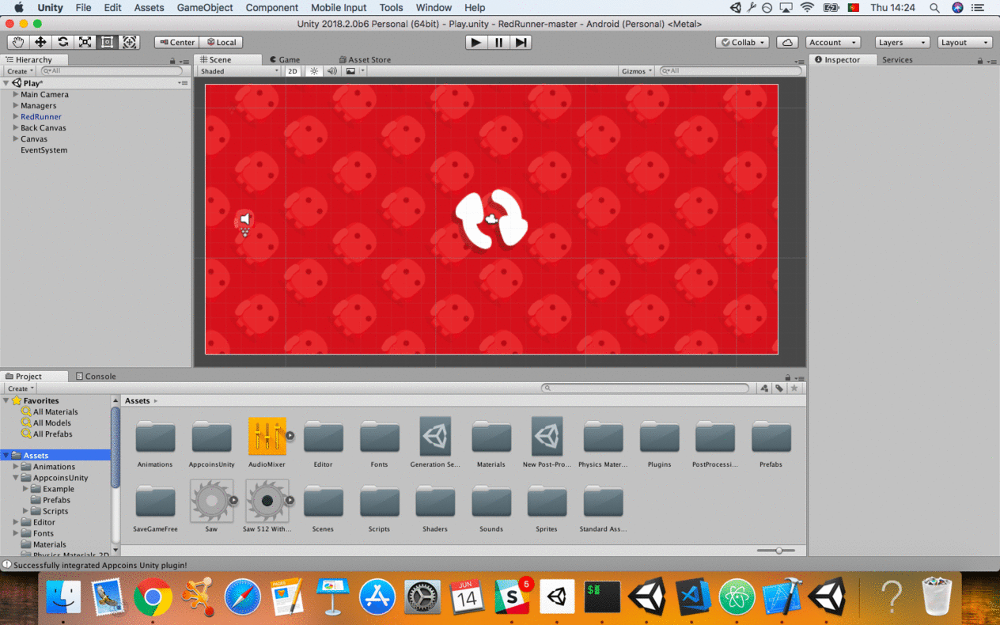
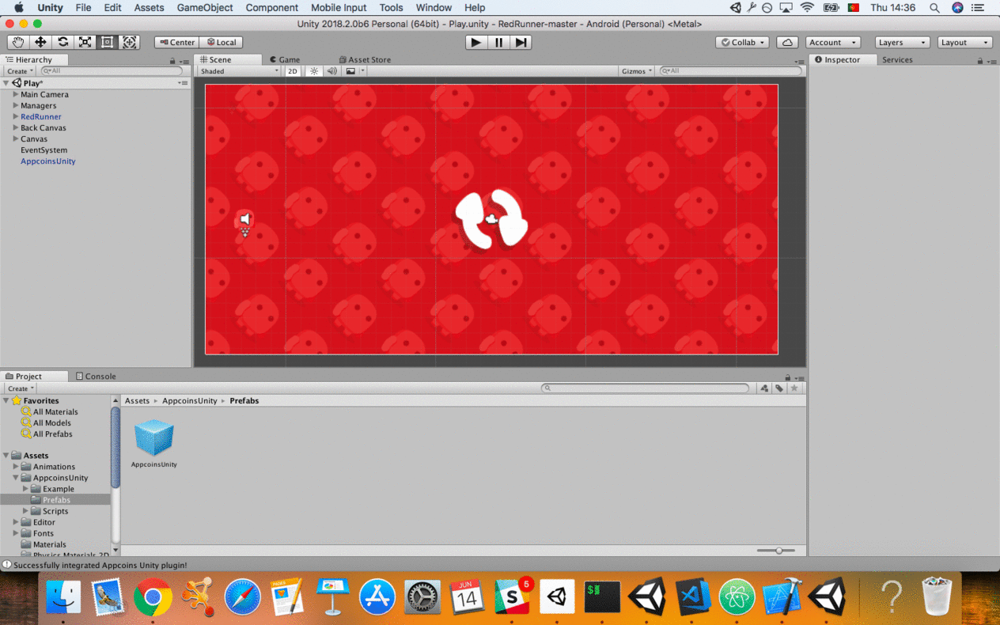

# Red Runner

We created this project to give you another example of how you can integrate the _Appcoins_ plugin to your game. For this example we are using an open source game called __Red Runner__. You can check their official page [here](https://github.com/BayatGames/RedRunner).
<p align="center">
  
</p>

## _APPCoins_ Plugin Integration Example
This is a very simple demonstration of how you can change your game's logic to integrate _In-App Purchases_. The only adjustment we made was that after the player dies for the first time if he wants to play another time he has to buy a life.

Process of integration:
1. Download Appcoins unity package [here](https://github.com/AppStoreFoundation/AppcoinsUnityPlugin/blob/develop/AppCoins_Unity_Package.unitypackage).
2. At Unity open your game's folder and import the _Appcoins_ unity package you just downloaded. You can do this by clicking in Assets -> Import Package -> Custom Package... .You have to import everything except the '/Appcoins/Example' folder that is optional. This folder is just another integration example.


3. On the top bar click _AppCoins_

4. Click _Custom Android Build_


5. Drag and drop to your hierarchy window the 'Assets/AppCoins/Prefabs/AppCoinsUnity.prefab' prefab file. ** Note:do not change the name of the AppcoinsUnity prefab.**


6. Open AppcoinsUnity game object in the inspector window and put the wallet's address where you want to receive your appcoins in the _Receiving Address_ slot.


7. The game logic we are changing is when the restart button is clicked we will redirect the game's flow, so on _OnReset_ method in _GameManager_ class we will call the _Purchaser's buyContinue_ method to deal with the purchase. (The _Purchaser_ class has to derive from _AppcoinsPurchaser_ class). My _Purchaser.cs_ file:

```
/* add this namespace to your script to give you  access to
the plugin classes. */
using Aptoide.AppcoinsUnity;

using RedRunner;

public class Purchaser : AppcoinsPurchaser
{

    //method gets called on successful purchases
    public override void purchaseSuccess(string skuid)
    {
        base.purchaseSuccess(skuid);
        //purchase is successful release the product

        if (skuid == "continue")
            GameManager.Singleton.OnPurchaseSuccessful();
    }
    //method gets called on failed purchases
    public override void purchaseFailure(string skuid)
    {
        base.purchaseFailure(skuid);
        //purchase failed perhaps show some error message

        GameManager.Singleton.OnPurchaseFailed();
    }

    //example methods to initiate a purchase flow
    /*the string parameter of the makePurchase method is the
    skuid you specified in the inspector for each product */
    public void buyContinue()
    {
        makePurchase("continue");
    }
}
```

8. Create an empty game object with the name you want (we named it _Purchaser_) and add a component with the script that has the _Purchaser_ class. Then drag and drop it to the slot named _Purchaser Object_ in _AppcoinsUnity_ game object.


9. Now we just have to create a product with the _SKUID_ named _continue_. To do this go to Assets -> Create -> AppCoins Product, add a name of your choice, the _SKUID_ will be _continue_ and add a price of your choice also. Ticking "Add to list" will make sure that the product is automatically added to the product list on the _AppcoinsUnity_ game object. If not, don't forget at the inspector window after you clicked the _AppcoinsUnity_ game object, to go to the Products' slot, put the size to _1_, then drag and drop your created product to Element 0's slot.
When every field is filled with info, don't forget to press "Apply". This will create the product in a folder called "Products" inside the Assets folder.


10. Your game is ready to rock!
